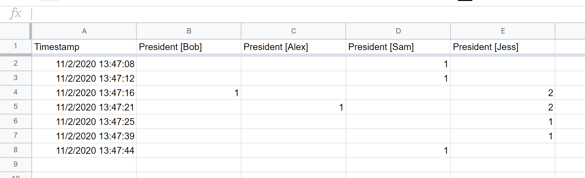
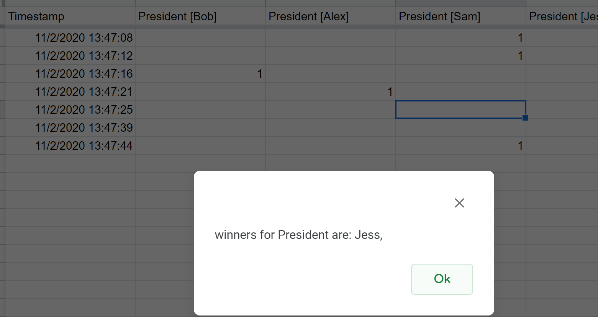
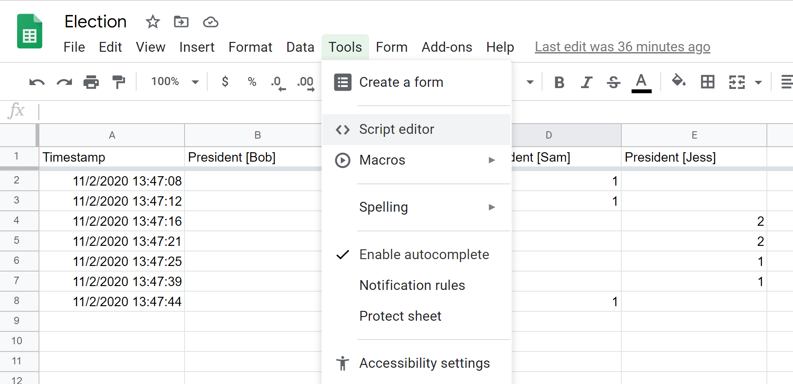
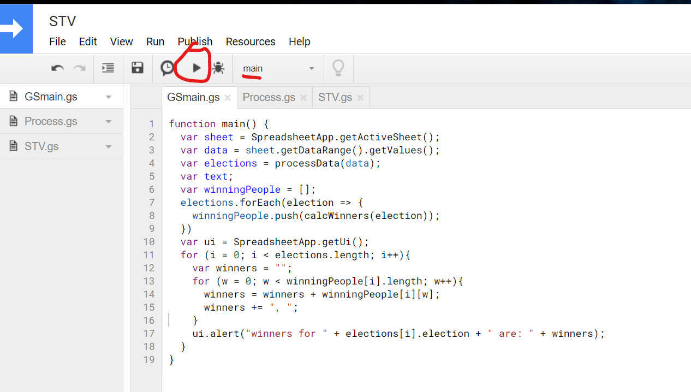
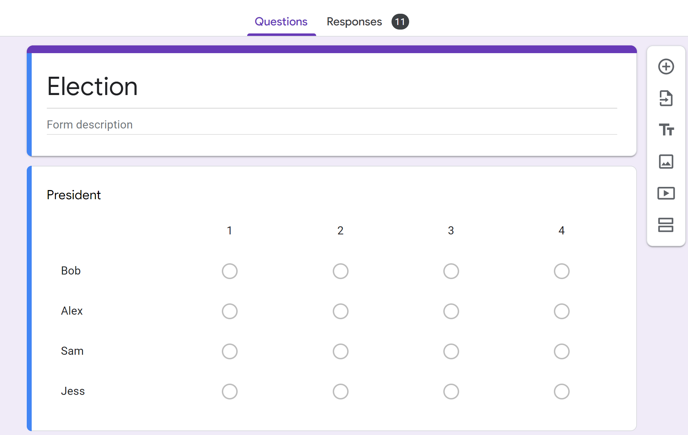

# Single-Transferable-Vote-JS-Google-Sheets
This project contains scripts that enable a single transferable vote ballot winner determination to be calculated on a ballot that is hosted on Google Forms.
(Big thanks to my high school for implementing this in their student council elections!)

## Motivation
Voter game theorey sucks. The selections of other voters should NOT be an influence when deciding who to vote for yourself. A single transferable voting system solves this problem by allowing the voter to rank as many participants as they like, and then allow the vote to transfer from their highest preference downwards as candidates are selected as winners/eliminated. Read more here: https://en.wikipedia.org/wiki/Single_transferable_vote

# example

This is an example outcome off a ballot election. In a normal election, Sam would be the winner as he got 3 primary votes. 
However in an STV election, the voters can rank their candidates in their preference. As you can see, only two voters(voters for Bob and Alex choose to have a second preference)
Thus, when the STV calculation begins, the candidate Bob will be eliminated and the vote from Bob will fall to their second preference of Jess.
Likewise, the candidate Alex will also be eliminated as they have the least amount of votes and the vote will be transfered to Jess.
At this point, Bob has 3 votes, Jess has 4. As the Voting Thresh-hold to be elected winner is 4. Jess will be elected winner.
As we can see, this is an outcome that 4 people prefer, compared to the outcome of Bob winning which only 3 people prefer. 

## Installation
Simply copy the text in the files here into Google script editor.
You can access the script editor via:

and then creating new files to copy and paste the code into.
Then just run the code like:

## Setting up the google form.
You may have multiple elections in one form, however each election must be a "Multiple choice grid" question.

## Notes
Due to the limitations of the Google Script platform, large ballots (tested at 1000+) may cause the election to fail due to "running out of memory". 
A workaround is currently underdevelopment, and aims to use the downloadable .csv format to calculate the winners of the STV election on locally executing JS. Will be delivered in time for the 2021 Student council elections!
